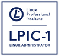
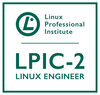

# 💻 About me

Faaaala Pessoal, Allan Fernandes na área e esse aqui é o repositório do Arena

Atualmente sou Engenheiro DevOps, focado em Cloud [AWS](https://aws.amazon.com/pt/), [OCI](https://www.oracle.com/br/cloud/), e automação com [Terraform](https://www.terraform.io/), [Ansible](https://www.ansible.com/), [BitBucket Pipelines](https://bitbucket.org/) e [GitHub Actions](https://github.com/)!

Estou estudando Python e automação no code com o n8n.

Gosto de codar ouvindo música 🎧, Rock, R&B, Hip-Hop. Mas quando a máquina ferve, nada como o silêncio! 🤫

### ☁️ Clouds 

 
 

### 🧰 Tools 

 
 
<!--
### 📜 Languages 

 
 
-->

### 🎓 Certifications

<!--START_SECTION:badges-->
<!-- 
-->

  

<!--END_SECTION:badges-->

 

  
 

Direitos registrados para Allan Fernandes - Level 4 Cloud  
R. Abílio Moreira de Miranda, 45 - Sala 1002 - Imbetiba - Macaé/RJ  
Telefone: 22.999442899
CNPJ 53.450.493/0001-28 
<!--
**gitarena/gitarena** is a ✨ _special_ ✨ repository because its `README.md` (this file) appears on your GitHub profile.

Here are some ideas to get you started:

- 🔭 I’m currently working on ...
- 🌱 I’m currently learning ...
- 👯 I’m looking to collaborate on ...
- 🤔 I’m looking for help with ...
- 💬 Ask me about ...
- 📫 How to reach me: ...
- 😄 Pronouns: ...
- ⚡ Fun fact: ...
-->
